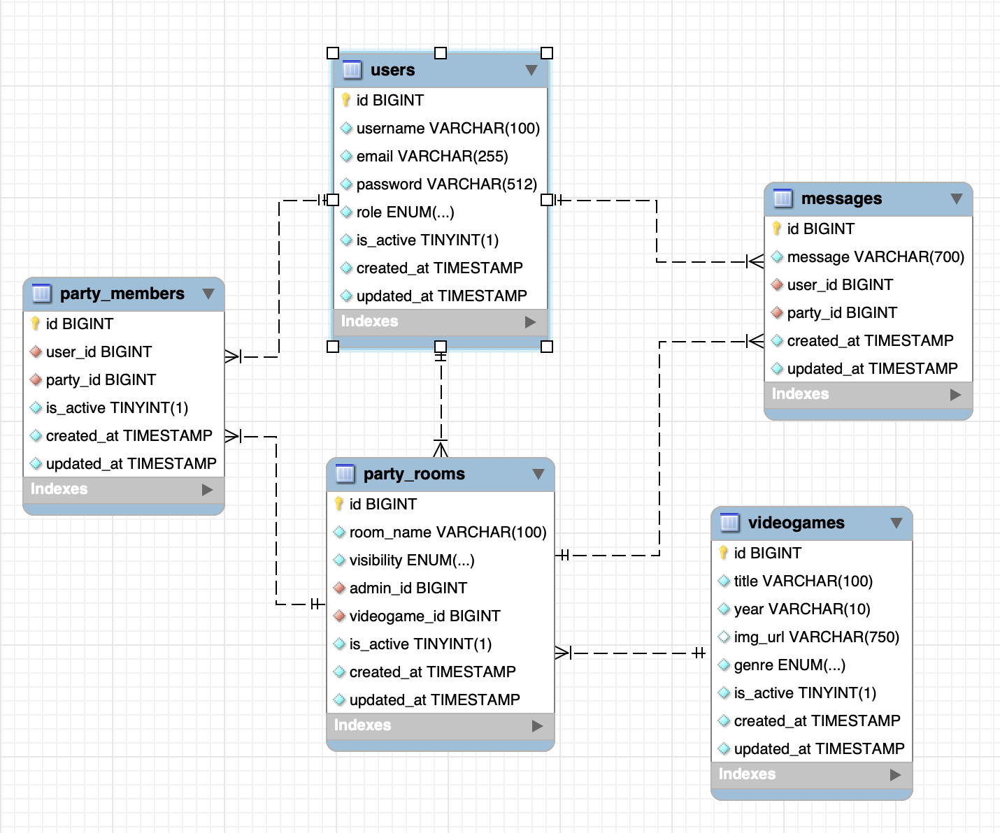

# Backend for a LFG chat with Laravel

<details>
  <summary>Content 📝</summary>
  <ol>
    <li><a href="#objective">Objective</a></li>
    <li><a href="#about-the-project">About the Project</a></li>
    <li><a href="#deployment-🚀">Deployment</a></li>
    <li><a href="#stack">Stack</a></li>
    <li><a href="#database-diagram">Database Diagram</a></li>
    <li><a href="#local-installation">Installation</a></li>
    <li><a href="#endpoints">Endpoints</a></li>
    <li><a href="#future-features">Future Features</a></li>
    <li><a href="#license">License</a></li>
    <li><a href="#contact">Contact</a></li>
  </ol>
</details>

## Objetive

The main objective of this project is the development of a backend chat application, with a group of three people collaborating on Git and written in PHP using the Laravel framework.

## About the Project

It involves creating a backend API for a 'looking for group' (LFG) chat, where users can create or search for chat rooms related to a game, manage them, or join as members.

## Stack

Used stacks:

<div align="center">
<a href="https://www.php.net/">
    
</a>
<a href="https://laravel.com/">
    
</a>
<a href="https://www.mysql.com/">
    
</a>
<a href="https://git-scm.com/">
    
</a>
<a href="https://www.postman.com/">
    
</a>
 </div>

## Database Diagram



## Local Installation

1. Clone the repository and run the following command to install the necessary dependencies:
   `$ composer i`
2. Connect your repository to the database by following the instructions in the env.example file.
3. Run migrations:
   `$ php artisan migrate`
4. Start server:
   `$ php artisan serve`
5. You can execute the endpoints using run in postman button bellow. You also can seed your database by running the sql tables on ./https-sql-seeders or by running this command:
   `$ php artisane db:seed`

## Run in Postman

[](https://app.getpostman.com/run-collection/30593617-8d18e73f-6296-429a-ac31-5b4ec2a33b95?action=collection%2Ffork&source=rip_markdown&collection-url=entityId%3D30593617-8d18e73f-6296-429a-ac31-5b4ec2a33b95%26entityType%3Dcollection%26workspaceId%3D1ed03365-3abe-4fb1-a48c-67e905761aa6)

## SQL Data

Data has been added to populate the SQL tables with users, partyrooms, partymembers, videogames and messages.

To login the users on this tables use password: 'Password1234&'

There is an admin user, login with admin@admin.com

## Endpoints

<details>
<summary>Endpoints</summary>

-   HELTH-CHECK

            GET http://localhost:8000/api

-   GUEST

    -   GET ALL VIDEOGAMES

            GET http://localhost:8000/api/videogames/

    -   GET VIDEOGAME BY ID

            GET http://localhost:8000/api/videogames/:id

    -   REGISTER

            POST http://localhost:8000/api/register

                body:

                ```json
                {
                    "username": "Dani Ochando",
                    "email": "david@tarazona.com",
                    "password": "Password83&"

                }
                ```

    -   LOGIN

            POST http://localhost:8000/api/login

                body:

                ```json
                {
                    "email": "david@tarazona.com",
                    "password": "Password83&"
                }
                ```


-   ADMIN ENDPOINTS

    -   CREATE VIDEOGAME

            POST http://localhost:8000/api/videogame

                body:

                ```json
                {
                    "title": "World of Warcraft",
                    "year": "2004",
                    "img_url": "https://via.placeholder.com/640x480.png/0000bb?text=dolorr",
                    "genre": "RPG",
                    "is_active": 1

                }
                ```
    -   UPDATE VIDEOGAME

            PUT http://localhost:8000/api/videogame/:id

                body:

                ```json
                {
                    "title": "Doom",
                    "year": "1994",
                    "img_url": "https://via.placeholder.com/640x480.png/0000bb?text=dolores",
                    "genre": "FPS",
                    "is_active": 1
                }
                ```
    -   DELETE VIDEOGAME

            DELETE http://localhost:8000/api/videogame/:id

    -   ADMIN GET ALL USERS

            GET http://localhost:8000/api/users

    -   ADMIN GET ALL PARTY ROOMS

            GET http://localhost:8000/api/partyrooms

-   USER ENDPOINTS

    -   GET USER PROFILE

            GET http://localhost:8000/api/profile

    -   UPDATE USER PROFILE

            PUT http://localhost:8000/api/update

            body:

                ```json
                {
                    "username": "miNuevoNombre"
                }
                ```
    -   USER LOGOUT

            POST http://localhost:8000/api/logout

    -   USER CREATES A PARTY ROOM

            POST http://localhost:8000/api/room

            body:

                ```json
                {
                "room_name": "room-de-juego-con-id-1",
                "videogame_id": "1"
                }
                ```
    -   GET PARTY ROOM BY VIDEOGAME

            GET http://localhost:8000/api/partygames/:id

    -   JOIN PARTY ROOM

            POST http://localhost:8000/api/partymembers/join/:id

    -   LEAVE PARTY ROOM

            POST http://localhost:8000/api/partymembers/leave/:id

    -   PARTY ROOM OWNER DELETES PARTY MEMBER

            DELETE http://localhost:8000/api/partymember

            body:

                ```json
                {
                "partyRoomId": 1,
                "partyMemberId": 2
                }
                ```
    -   PARTY MEMBER POST A MESSAGE

            POST http://localhost:8000/api/message

            body:

                ```json
                {
                "party_id":"1",
                "message":"¡hola!"
                }
                ```
    -   PARTY MEMBER GET ALL PARTY ROOM MESSAGES

            GET http://localhost:8000/api/message

            body:

                ```json
                {
                "party_id":"1"
                }
                ```
    -   PARTY MEMBER DELETE ITS OWN ROOM MESSAGES

            DELETE http://localhost:8000/api/message/:id

            body:

                ```json
                {
                "party_id":"1"
                }
                ```
    -   PARTY MEMBER UPDATE ITS OWN ROOM MESSAGES

            PUT http://localhost:8000/api/message/

            body:

                ```json
                {
                "party_id": "1",
                "message_id": "1",
                "newMessage": "donde dije digo, digo Diego, y dígalo dígolo dícese lo dicho"
                }

</details>

## Future Features

[ ] Fix delete user conflicts with other table relations.

## License

This project is under an MIT license.

## Contact

Cristian Pérez, Mery Rodriguez y Paco Fuentes. 2023

<a href = "mailto:pacofuentes.work@gmail.com"></a>
<a href="https://www.linkedin.com/in/paco-fuentes-805a40290/" target="_blank"></a>

</p>
